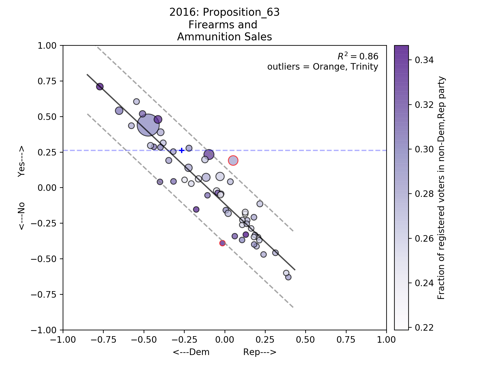

# CaliVoting

An exploratory look at some of the publicly available data on historical California elections results. In particular, I'm interested in seeing how citizens in different geographic regions voted on ballot propositions, and how those patterns correlate to party registration statistics. To add complexity to the models, I'm also playing around with census demographics data.

For now, I'm treating this is as an educational exercise to pick up some tricks of the data science trade. Eventually, it would be great to convert the project into a web app that allows for easy look-up of election results in California.

## Data Sources

### California Secretary of State
http://www.sos.ca.gov/elections/prior-elections/statewide-election-results/

The CA SoS provides Excel files for statement of vote (SoV) and statement of registration (SoR) data going back to 2002. I wrote some scripts to download ([scrape_sos.ipynb](./scrape_sos.ipynb)) and process ([process_sos.ipynb](./process_sos.ipynb)) county-level records of ballot measure results and registration data into more easily readable .csv files. The inconsistent, non-standard formatting of the excel files make this something of a chore.

Some exploratory analysis of this data can be found in [explore_CA_statewide_measures.ipynb](./explore_CA_statewide_measures.ipynb), which has some useful loading functions for the processed .csv files. Here's a representative example of the analysis results:

### Statewide database
http://statewidedatabase.org/index.html

This database stores SoV and SoR records at a much finer resolution: the precinct level. Most files are .dbf, which are intented for access via mapping software. Geopandas does a good job loading them up. As it turns out, registration precincts are not the same as voting precincts, and the SWDB folks have performed a massive consolidation of the data into common geographical units (they call them SR precincts). There are roughly 22,000 such precincts in CA. Using crosswalk files also provided by SWDB, I aggregated the data to the census tract level (5,000 or so in CA). This allows for comparison of voting history with demographic variables obtained via the census API (using this [handy python wrapper](https://pypi.org/project/census/)).

https://cdn.rawgit.com/cnehrkorn/CaliVoting/master/prop56_map.html
